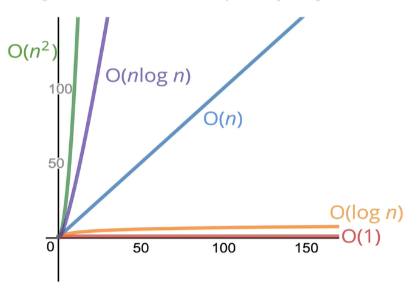

# 빅오 표기법(Big O Notation)

<br>

- **입력값** 과 **실행 시간**의 **상관 관계**
- 여러가지 코드를 서로 비교하고 **알고리즘의 성능**을 분석, 평가하기 위해 사용
- 정확한 갯수 보다는 **전반적인 추세**
- 빅오로 측정되는 알고리즘의 시간과 공간 복잡도는 하드웨어의 영향을 받지 않음

<br>

```javascript
function addUpTo(n) {
  return (n * (n + 1)) / 2;
}
// 항상 3개의 연산 → O(1)

function addUpTo(n) {
  let total = 0;
  for (let i = 1; i <= n; i++) {
    total += i;
  }
  return total;
}
// 5n + 2 → 5n이나 10n이나 모두 n
// ex) for문 중첩 → O(n^2)
```

<br>

상수 시간 : O(1)

- 2 + 2 나 100만 + 2 나 똑같은 1번의 연산이다.
- 변수의 할당도 똑같은 1번의 연산이다.
- 배열의 원소 1개에 접근하는 것 또는 객체의 1개의 필드에 접근하는 것도 1번의 연산이다.

선형 시간 : O(n)

- 반복문 안에 있는 연산들은 반복문의 길이(n)에 달려있다

<br>



<br>
<br>

## 공간복잡도

알고리즘이 실행될 때 사용하는 **메모리 양**, 입력 되는 것을 제외하고 **알고리즘 자체**가 필요로 하는 공간을 의미

```
불리언, 숫자, undefined, null → O(1) 공간

문자열 → O(n) 공간

배열, 객체 → O(n) 공간, (n은 배열의 길이이거나 키값의 갯수)
```

```javascript
function sum(arr) {
  let total = 0; // O(1)
  for (let i = 0; i < arr.length; i++) {
    // O(1)
    total += arr[i]; // 메모리 안따짐
  }
  return total;
}
// 총 공간복잡도: O(1)
```

```javascript
function double(arr) {
  let newArr = [];
  for (let i = 0; i < arr.length; i++) {
    newArr.push(2 * arr[i]);
  }
  return newArr;
}
// 전체적으로 주어진 배열의 길이에 따라 메모리공간이 결정.
// → O(n)의 공간복잡도
```

<br>
<br>

## 로그의 개념

- 로그함수는 지수함수의 역

```
log₂8은 2³의 역
log₂64은 2⁶의 역
```

- 대략, 1보다 작아지기 전에 2로 나눠지는 횟수

```
8 / 2 / 2 / 2 = 1
1이 될 때까지 2를 3번 나눠야 하므로 log₂8 = 3

64 / 2 / 2 / 2 / 2 / 2 / 2 = 1
1이 될 때까지 2를 6번 나눠야 하므로 log₂64 = 6
```

- O(log n) 은 O(1)과 비슷한 아주 완만한 기울기를 보인다.

```
O(1) > O(logn) > O(n) 순으로 가장 효율적
```

- 빅오 표기법에서 밑이 2인 로그는 그냥 log로 생략 가능

```
log === log₂
```
